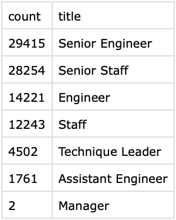

# Pewlett Hackard Analysis

## Overview of Project
In this project, I was asked to help Bobby prepare for the upcoming wave of retirement at Pewlett Hackard, which they are calling the "silver tsunami". To complete this analysis, I was given the following tasks:
- Create a database of the employees that are reaching retirement age
- Determine the number of retiring employees per title
- Identify employees who are eligible to participate in a mentorship program

## Results
After completing this analysis, I gathered the following results:
- 90,398 employees at Pewlett Hackard are reaching retirement age.
- The majority of retiring employees are either Senior Engineers or Senior Staff.
  - The full breakdown of retiring employees by title is shown below
  -
- Only 1,549 employees are eligible to participate in the mentorship program.
- After the "silver tsunami", the number of employees at Pewlett Hackard will drop from ~300,000 to ~210,000.

## Summary
